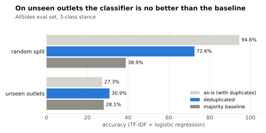
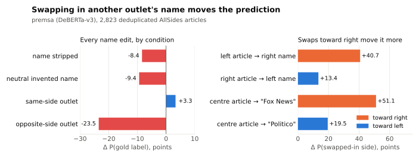
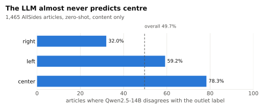
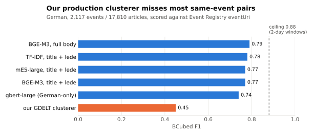

# Experiments

Five experiments, each with the question, the method, the result and what it means.
Sections 1–3 are about stance labels, section 4 about translation and section 5 about
clustering. The code for 1–3 is in `muws-allsides-dataset/stance_detection_experiment/`,
for 4 in [../scripts/](../scripts/), and for 5 in `eventregistry/clustering_eval/`.

---

## 1. Are the stance labels per article or per outlet?

**How the labels are made.**
- **AllSides:** blind surveys of ordinary Americans plus balanced editorial panels. Its
  [audit methodology](https://www.allsides.com/sites/default/files/AllSides-Media-Bias-Audit_Example-March-2022.pdf)
  samples 5–10 headlines and averages the ratings into **one score per publication**.
- **Ground News:** rates nothing itself. It averages three US agencies (MBFC on 25,435
  articles, Ad Fontes on 19,034, AllSides on 8,330). It says so directly: *"The analysis is
  done at the publication level."* The agencies **disagree on 32.1%** of articles (9,244 of
  28,833).
- **Ad Fontes** (not used): the only provider that rates individual articles, using 3+
  human analysts.

**Test.** Group the AllSides eval set (11,779 records, 15 outlets) by outlet and count
distinct labels.

**Result.** **All 15 outlets have exactly one label (100% purity).** In the full scrape,
408 of 411 outlets are pure. The three exceptions changed rating on a single date.

**Deduplication correction.** The eval set holds only **2,807 distinct texts in 11,779
records** (4.2× duplication from AllSides sidebars). The split hashed `article_id`, so the
same text landed in both train and test for 77.9% of records. TF-IDF + logistic regression,
each split compared with its own majority baseline:

| split | as-is | deduplicated | majority baseline (dedup.) |
|---|---|---|---|
| random | 94.6% | **72.6%** | 38.9% |
| unseen outlets | 27.3% | **30.9%** | 28.1% |

**Conclusion.** Of the 94.6%, 22 points came from memorising duplicates. The rest is the
model recognising the outlet: on unseen outlets it is no better than the majority baseline.
Earlier random-split figures should not be cited. The literature reports the same problem:
Baly et al. (EMNLP 2020) found BERT drops from 79.8% to 36.8% on unseen outlets.

---

## 2. Do classifiers read the publisher's name?

**Setup.** The model is premsa, a DeBERTa-v3 political-leaning classifier and the best
available in a 2025 benchmark, used 3-class. It ran on 2,823 deduplicated AllSides
articles, of which 1,789 (63.4%) mention their own publisher. Each name mention was
stripped, replaced with a neutral invented name, swapped to a same-side outlet, or swapped
to an opposite-side outlet (Politico = left, BBC = centre, Fox News = right). We measure
the change in softmax probability, with bootstrap CIs.

| condition | Δ P(gold label), points |
|---|---|
| name stripped | −8.4 |
| neutral invented name | −9.4 |
| same-side outlet | +3.3 |
| **opposite-side outlet** | **−23.5** |

Split by direction, the swap effect is **asymmetric**:

| swap | n | Δ P(swapped-in side) |
|---|---|---|
| left article → right outlet name | 483 | **+40.7** [37.8, 43.7] |
| right article → left outlet name | 751 | +13.4 [12.0, 14.9] |
| centre article → "Fox News" | 556 | **+51.1** toward right |
| centre article → "Politico" | 556 | +19.5 toward left |
| centre article → "The Hill" (same-side control) | 556 | −5.5 on centre, +4.6 toward right |

**Where the effect comes from.** We retrained with the test outlets held out of training
(model A), and also with all outlet names stripped from training (model B):

| | premsa | A: unseen outlets | B: unseen, names stripped |
|---|---|---|---|
| opposite-side swap effect | +24.1 | **+7.6** | +19.0 |
| accuracy | 66.6% | 52.0% | 53.8% |

**Conclusion.** The best available classifier relies heavily on the publisher's name, and
most of that comes from being tested on outlets it saw in training (24.1 → 7.6). Stripping
names from training did not help. That comparison is confounded, though: B's best
checkpoint came from epoch 1 and A's from epoch 3, and each was trained with a single seed.

---

## 3. How often does an LLM disagree with the outlet label?

**Setup.** Qwen2.5-14B-Instruct, zero-shot, predicting left / center / right from the
content only. 1,465 unique articles, all Fox News plus up to 250 per other outlet. Script:
[../scripts/outlet_outlier_check.py](../scripts/outlet_outlier_check.py).

**Result.** The LLM agrees with the label on **50.3%** of articles. Disagreement depends on
the label, not the outlet:

| label | disagreement | example outlets |
|---|---|---|
| right | 32.0% | **Fox News 28.9% (the lowest of all 15)**, NY Post 34.4% |
| left | 59.2% | CNN 57.8%, Guardian 59.8% |
| **center** | **78.3%** | The Hill 89.6%, Reuters 77.8% |

- Fox News is not an outlier. It is the *most* consistent outlet.
- `center` means "no lean", which has no positive markers in text, so the model almost
  never predicts it.
- 77.7% of disagreements are made with p > 0.95, so they are confident rather than hedged.
- The model appears to read the **subject** as the stance. A straight Fox report centred
  on a Democrat is called left, while a piece with loaded framing ("Socialist shockwave")
  is called right.

**Conclusion.** Neither the label nor the LLM measures an article's stance, so the 50%
disagreement is not a label-error rate. However, those disagreeing articles are a good
pool to send for human adjudication.

---

## 4. Ground News' translation deletes entities

Ground News stores both the original title (`original_title`) and its English translation,
so the damage can be measured. **41.2% of articles (18,969) are machine-translated**; 4,167
distinct German titles were audited. Script:
[../scripts/translation_audit.py](../scripts/translation_audit.py).

**Worked example.** A 15-outlet story about goalkeeper Jonas Urbig succeeding **Manuel
Neuer** at **FC Bayern**:

| German | Ground News English |
|---|---|
| Urbig weicht Fragen zur **Neuer**-Nachfolge beim FC Bayern | Urbig Avoids Questions About the **New** Succession at FC Bayern |
| **Bayern** und DFB-**Tor**: Urbig überrascht … | **Bavaria** and DFB **Gate**: Urbig Surprises … |

The story's topic tags include **"Mohammed Bin Salman"**, so the tagger read the damaged
English text.

| defect | distinct titles | % |
|---|---|---|
| `USA` / `US-` → "Us" | 96 | 2.3% |
| `Bayern` (the club) → "Bavaria" | 3 | 0.1% |
| coalition colours (`Schwarz-Rot` → "Black-Red") | 5 | 0.1% |
| surname `Neuer` erased | 4 | 0.1% |
| Luxembourgish tagged `de`, left untranslated | 4 | 0.1% |

**What this does and does not show.** The rates are small; the finding is the *mechanism*.
It is **not** established that Ground News clusters on the translated text, because its
clustering is undocumented and the damaged Urbig cluster stayed together. What the data
motivates is a testable question: **for multilingual event clustering, is it better to
translate first, to cluster per language and then link the clusters (as EMM does), or to
use multilingual embeddings?**

---

## 5. Event clustering

**Setup.** German-only data, scored against Event Registry's own `eventUri` groups: 2,117
events and 17,810 articles, split 50/50 into dev and test by event. Thresholds were tuned
on dev. Articles were clustered within 2-day windows.

| method (test set) | BCubed P | R | **F1** |
|---|---|---|---|
| *ceiling: perfect clustering within each 2-day window* | 1.00 | 0.79 | *0.88* |
| BGE-M3, full body | 0.85 | 0.74 | **0.79** |
| TF-IDF, title + lede | 0.84 | 0.73 | 0.78 |
| mE5-large, title + lede | 0.81 | 0.74 | 0.77 |
| BGE-M3, title + lede | 0.84 | 0.71 | 0.77 |
| gbert-large (German-only model) | 0.78 | 0.71 | 0.74 |
| **our GDELT clusterer** (SequenceMatcher, t = 0.65) | 0.98 | **0.29** | **0.45** |

- **Our production GDELT clusterer misses about two-thirds of same-event pairs.** Tuning
  its threshold reaches only 0.51.
- **TF-IDF ties BGE-M3.** This is probably because ER's own clustering is word-based, which
  would make the metric reward methods that resemble it. **Human verification is needed
  before claiming anything.**
- The German-specific model does worse than the multilingual ones.
- The 2-day windows cap every method at 0.88, since 53% of events last longer than that.
  Fixing the windowing would gain more than switching models.
- The cross-lingual question cannot be tested with this data, because the pull was
  German-only. It needs a multilingual pull.
