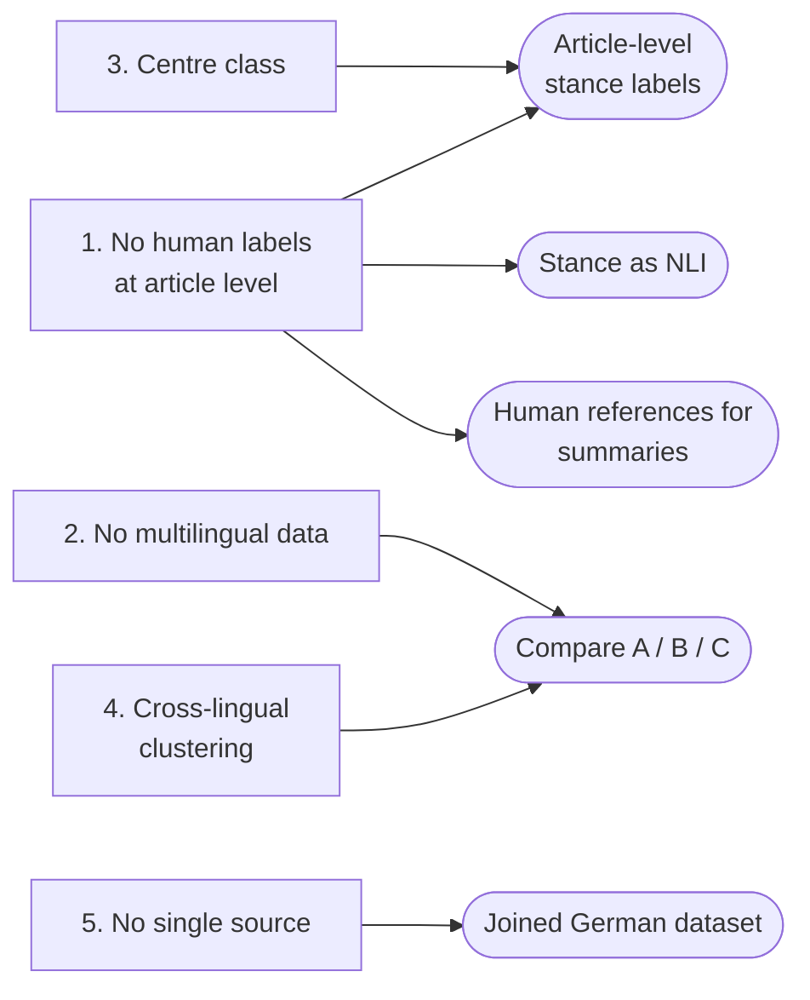

# Open Problems and Future Directions

The five problems below are the ones that block further research. Smaller data issues are
noted per source in [sources.md](sources.md).

---

## 1. No human-labelled data at the level the tasks need

Every downstream task needs human ground truth, and none of the sources provides it at the
right level:

- **Stance labels are per outlet, not per article.** AllSides and Ground News give every
  article its publisher's rating, so a classifier trained on them learns *who published
  it* rather than what the article says. On unseen outlets it is no better than guessing
  the majority class ([experiments §1–2](experiments.md#1-are-the-stance-labels-per-article-or-per-outlet)).
- **Summaries and stance comparisons are GPT-generated** (Ground News), so they can serve
  as a baseline but not as a reference.
- **Event clusters come from algorithms**, either the providers' own or ours, and have not
  been verified by humans.

Only Ad Fontes Media rates individual articles.

## 2. No multilingual data

The dataset is German by design, but studying how news differs across countries and
languages needs the same events covered in several languages. None of the current sources
provides that:

- **GDELT** and **Event Registry** were pulled for German only. Event Registry *can* return
  all languages of an event, but that needs a paid plan.
- **Ground News** machine-translates everything into English, so the original-language
  coverage is not available as such.
- **AllSides** is English (US) only.

## 3. The `center` class is hard to predict

Classifiers and LLMs judge political leaning in a polarised way. They look for cues that
signal one side or the other, and assign left or right when a cue is present. `center` is
defined only by the *absence* of such cues, so there is nothing positive to detect. An LLM
disagrees with the `center` label on 78% of articles, against 32% for `right`
([experiments §3](experiments.md#3-how-often-does-an-llm-disagree-with-the-outlet-label)).

## 4. It is open which clustering approach works across languages

There are three ways to group articles about the same event when they are in different
languages:

| approach | how it works | risk |
|---|---|---|
| **A. Translate, then cluster** | machine-translate everything into one language (usually English), then group once | translation errors become clustering errors, e.g. *Neuer* → "new", *Bayern* → "Bavaria" ([experiments §4](experiments.md#4-ground-news-translation-deletes-entities)) |
| **B. Cluster per language, then link** | split articles by language, group each language separately (many groups per language), then merge groups across languages that describe the same event. EMM and Event Registry work this way | a missed link splits one event into several |
| **C. Multilingual embeddings** | represent all articles in one shared multilingual space without translating, and group once | quality varies by language; the threshold needs tuning |

Comparing them needs multilingual data (problem 2) and human-checked clusters (problem 1).
So far, only a German-only comparison has been run
([experiments §5](experiments.md#5-event-clustering)).

## 5. No single source has structure, text and labels together

GDELT gives multi-outlet stories, Event Registry gives full text, and Ground News gives
labels. A usable dataset needs all three, which means joining the sources on the 56
domains they share ([sources](sources.md#joining-the-providers)).

> **Note:** Event Registry's terms allow the data to be used for research only, not
> redistributed. GDELT metadata is openly licensed.

---

## Future directions

| direction | addresses | what it needs |
|---|---|---|
| **Article-level stance labels**: annotate the articles where an LLM and the outlet label disagree, or license Ad Fontes ratings | 1, 3 | annotators or a licence |
| **Stance detection as NLI** (article + claim → favor / against / neutral) | 1 | a human-annotated set; the setup and controls are ready |
| **Compare clustering approaches A, B and C** across languages | 2, 4 | a multilingual pull (paid Event Registry plan, or EMM data) and ~100 human-checked clusters |
| **Human references for summaries and stance comparison**, starting by verifying ~100 Ground News stance comparisons | 1 | annotation time |
| **Build the joined German dataset** (GDELT story → Event Registry text → Ground News outlet label) | 5 | an agreed date range and topic list; Jan 2025 → now takes about 15 hours to collect |

Possible partners: EMM (EU cross-lingual news clustering) and Ad Fontes Media
(article-level bias ratings).
