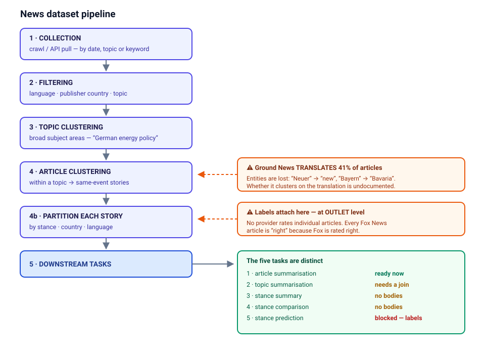
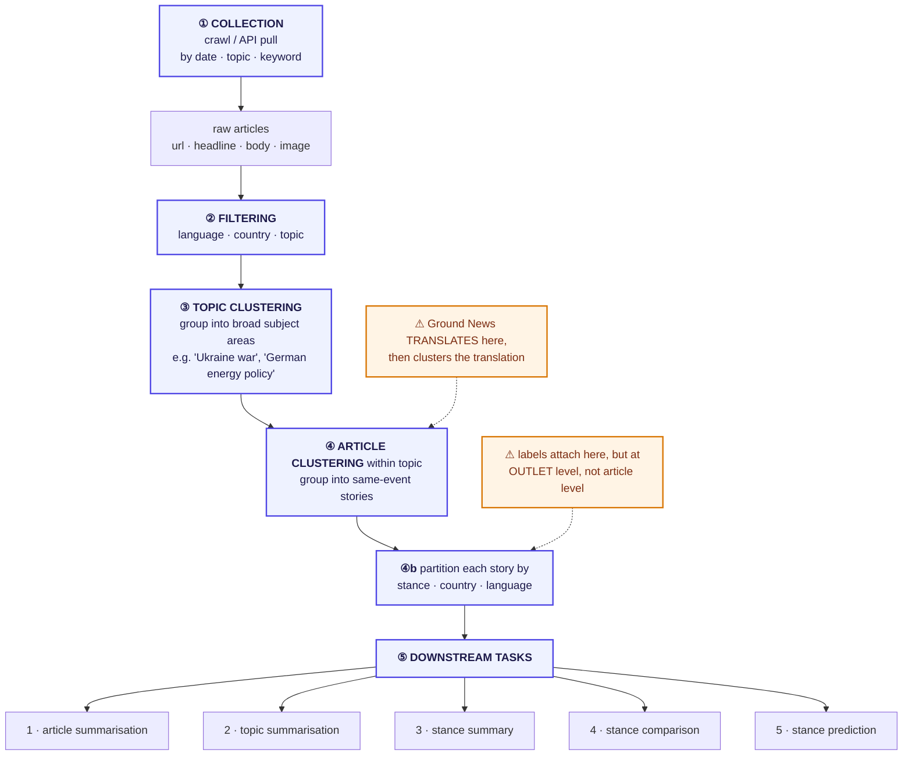

# The Pipeline, and Where Each Provider Sits On It

The target pipeline has five stages. Providers differ less in *what* they give you than
in **which stages they have already performed for you**, and whether their version of a
stage is one you would have chosen.

---

## 1. The pipeline

Mermaid source (editable — renders on GitHub, needs an extension in VS Code)

Two things are worth naming explicitly because they are where the providers go wrong:

- **Translation is not a free operation.** Ground News translates to English *before*
  step ④, so clustering runs on translated text. See
  [translation_problem.md](translation_problem.md).
- **Labels attach at step ④, but at the wrong granularity.** Every provider that offers a
  stance label attaches it to the *outlet*, then inherits it down to the article. See
  [stance_labels.md](stance_labels.md).

---

## 2. Provider × stage matrix

"**Done**" = the provider performs this step and hands you the result.
"**Ours**" = we must perform it. "**Unknown**" = the provider performs it but does not
document how, and it is not recoverable from the data.

| Stage | **AllSides** | **Ground News** | **GDELT** | **Event Registry** |
|---|---|---|---|---|
| ① Collection | Done (by date) | Done (trending) | Done (census) | Done (by date+lang) |
| ② Filtering | Partial | Done | **Ours** | Done |
| ③ Topic clustering | Done (human, editorial) | Done (**machine, on translated text**) | Partial (GKG themes) | **Not collected** |
| ④ Article clustering | Done (editorial) | Done (**on translation**) | **Ours** | **Effectively absent** |
| ④b Stance partition | Done (outlet-level) | Done (outlet-level) | Impossible (no labels) | Impossible (no labels) |
| ⑤ Downstream | — | ships **LLM-generated** stance summaries + bias comparison (tasks 3–4 outputs, not ground truth) | — | — |

---

## 3. Stage-by-stage, per provider

### AllSides

| Stage | How it is done |
|---|---|
| ① **Collection** | We scrape AllSides' own headline-roundup pages over a date range. AllSides' upstream selection of *which* stories get a roundup is **unknown** — it is an editorial decision, undocumented. |
| ② **Filtering** | None available to us. AllSides is US-national-politics by editorial remit; the filter is baked in upstream and not a parameter. Result: 0 German articles. |
| ③ **Topic clustering** | Done by AllSides editors; surfaced as human-readable topic tags (`Donald Trump`, `Immigration`, `Economy And Jobs`). High quality, 100% coverage. |
| ④ **Article clustering** | Done by AllSides editors. Each story page is one event with a left/center/right triplet plus "More from the Left/Center/Right" sidebars. **Caveat:** the sidebar articles (`is_featured: false`) are *related-outlet* picks, not necessarily same-event, and they cause ~8× article inflation (68,352 slots → 8,072 unique URLs). |
| ④b **Stance partition** | This is AllSides' entire product — the three-column layout *is* the stance partition. But the partition is by **outlet rating**, so it is balanced by construction (left 22,967 / center 22,669 / right 22,716), which is a layout artefact rather than a property of the news. |

### Ground News

| Stage | How it is done |
|---|---|
| ① **Collection** | We scrape the homepage, `/top`, `/blindspot` and ~20 `/interest/<topic>` pages. This is a **trending** axis, not a date axis — there is no "give me 3 March 2026" endpoint. Historical coverage only via Wayback replay, best-effort. Yield is ~2 stories/day. |
| ② **Filtering** | Ground News filters by topic (`/interest/`) and exposes per-source place, so country filtering is possible post-hoc. Language is tagged per article but **misassigned** — Luxembourgish (`rtl.lu`) is tagged `de`. |
| ③ **Topic clustering** | Done, 99.8% coverage, and the tags *read* like human ones (`Politics`, `Europe`, `Germany`) — but they are **machine-assigned, and assigned on the translated text**, so they inherit its errors. One Bundesliga goalkeeper cluster is tagged `Mohammed Bin Salman`. Treat them as machine labels, not editorial ones. |
| ④ **Article clustering** | Done by Ground News' own pipeline. **Articles are machine-translated into English first** (41% of all articles, 18,969/46,030, carry an `original_title`), and clustering runs on the translation. Median 16 outlets per story — the best cluster breadth of any provider here. The mechanism beyond "editorial + vendor pipeline" is **unknown**. |
| ④b **Stance partition** | Per-source `source_bias` on a 7-point scale. Aggregated from **three** rating agencies — Media Bias/Fact Check (25,435 articles), Ad Fontes Media (19,034), AllSides (8,330) — averaged where they differ. **They disagree on 32.1% of articles.** All three rate *outlets*, never articles. 37.4% of labels are the literal string `unknown`, concentrated on the small non-English outlets that make up the German tail. |
| ⑤ **Downstream (pre-computed)** | Ground News ships GPT-generated (`chatGptSummaries`) `summary_left` / `summary_center` / `summary_right` (49.3% of stories), a `bias_comparison` paragraph, and a `generated_headline`. These are *outputs* of tasks 3 and 4 — useful as weak supervision or as a baseline to beat, **not** as ground truth. |

### GDELT

| Stage | How it is done |
|---|---|
| ① **Collection** | A complete census. Every 15-minute GKG dump since 2015-02-19 is downloadable; we pulled Jan–Aug 2026 (20,350/20,350 slots, zero failures, 172 GB of bandwidth → **3,835,367 German articles**). **The funnel:** those 3.8M articles cluster into 2,015,373 stories, of which `--min-outlets 3` keeps **173,388 stories holding 1,408,753 articles** — the figure quoted everywhere downstream. 3.8M is what was collected; 1.4M is what survived the 3-outlet filter. Alternatives: BigQuery (1 TB/month free sandbox) or the DOC API (**capped at 250 results, no pagination** — unusable for volume). |
| ② **Filtering** | **Ours.** GDELT exposes `sourcelang` and `sourcecountry` on the DOC API, but the bulk-dump route has **no outlet-country field** — all 173,388 of our stories carry `countries: ["?"]`. Language filtering we do ourselves on the dump. |
| ③ **Topic clustering** | Partial. GKG V2Themes give machine-assigned theme codes at 100% coverage, but they are high-recall/low-precision and include artefacts of our own language filter (`TAX_ETHNICITY_GERMAN`, `TAX_WORLDLANGUAGES_GERMAN` are top-10 "topics"). Usable as features, **not** as human-readable topics. |
| ④ **Article clustering** | **Entirely ours** — `gdelt_cluster_bulk.py`: greedy single-pass, bucketed by day, blocked on a rare-token inverted index, similarity = `SequenceMatcher` over normalised titles, threshold **0.65**, `--min-outlets 3`. Same-media-group domains (the Ippen network: merkur.de, tz.de, hna.de, fr.de, …) collapse to one outlet first, so syndication cannot fake breadth. Result: **3,811 stories reach 30+ independent outlets** — the single biggest asset in the project. Known weaknesses: a story crossing midnight splits into two ids; a 0.65 threshold merges recurring headlines (weather, market wraps) within a day. |
| ④b **Stance partition** | **Impossible.** Stance is `unknown` for all 1,408,753 articles. Would require joining outlet ratings from elsewhere. |

### Event Registry

| Stage | How it is done |
|---|---|
| ① **Collection** | Authenticated REST API, paginated, filtered by `lang="deu"` over a date window. Easiest integration of the four by a wide margin. **Hard 30-day window** on the free tier; anything older needs the paid archive at 5 tokens per searched year. |
| ② **Filtering** | The richest filter set of any provider here — `lang`, `sourceLocationUri`, `categoryUri`, `conceptUri`, `sourceUri`, `authorUri`, `startSourceRankPercentile`, `dataType` (news/pr/blog), plus `ignore*` negations of all of them. See [api_filters.md](api_filters.md). |
| ③ **Topic clustering** | **Not collected.** `concepts` and `categories` are excluded by the default `returnInfo`, so our pull has zero topics. This is a fixable scraper defect, not a provider limitation — but fixing it costs tokens we no longer have. |
| ④ **Article clustering** | ER has its own event pipeline (`eventUri`), and it is **effectively absent in practice**: 83.5% of articles have a null `eventUri`. **Note the two layers:** the *raw* pull still holds 2,729 distinct events over 21,416 articles — enough that [future_directions.md](future_directions.md) uses a 2,117-event subset as clustering ground truth — but `unify.py` **drops `eventUri`**, so the *unified* file is 100% singletons. The clustering signal exists upstream and is discarded downstream. **Mechanism:** of 59,088 articles flagged `isDuplicate: true`, exactly **2** carry an `eventUri` — ER routes duplicates to an original instead of into an event. And the duplicate flag fires *across distributors*: 6,164 of 14,830 distinct duplicate-flagged titles appear at ≥2 domains, up to **48 domains** for a single dpa wire item. So the exact case you most want as a cluster — one wire story carried by 48 independent German outlets — is the case ER deletes from its event graph. **Recoverable:** grouping the raw file by normalised title yields 9,678 titles at ≥2 domains covering 67,005 articles (51.7%), ~8× more than `eventUri` surfaces, at zero API cost. |
| ④b **Stance partition** | **Impossible.** No bias signal of any kind. |

---

## 4. What is genuinely unknown

Marked "unknown" above because the provider does not document it and it cannot be
reconstructed from the data we hold:

- **AllSides** — how stories are selected for a roundup at all; how the three featured
  articles per story are chosen from the candidate pool.
- **Ground News** — the clustering algorithm; which MT system performs the translation;
  which exact model generates the summaries and `bias_comparison` (the payload object
  is named `chatGptSummaries`, so the family is GPT, but no version is exposed); why `summary_right` is
  empty on many stories that have left and center summaries.
- **GDELT** — how GKG assigns V2Themes (documented as a proprietary taxonomy).
- **Event Registry** — the `sim` score's definition; why `sim == 0` on 96.8% of
  duplicate-flagged articles.
