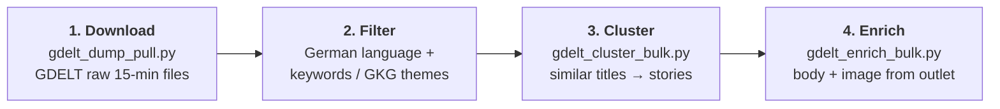

# GDELT Collector

Collects German news from GDELT, groups the articles into multi-outlet stories, and
fetches each story's article text and image from the outlet.

## How it works



| step | what happens | measured (Jan–Aug 2026) |
|---|---|---|
| **1. Download** | GDELT publishes one GKG file every 15 minutes (96 per day, back to 2015). Each file lists the URL, title and themes of every article GDELT saw. | ~8.5 MB per file; ~68 files/min with 8 workers |
| **2. Filter** | Keep German-language articles whose title matches a keyword or whose GKG themes match a theme. | ~190 German articles per 15 min; the 30-term politics filter keeps 3.3% |
| **3. Cluster** | Greedy clustering of normalised titles within each day (similarity ≥ 0.65). Outlets from the same media group count once. Keep stories with 3+ outlets. | 3.8M articles → 173,388 stories (1.4M articles) |
| **4. Enrich** | Fetch one article per story from the outlet: body text, `og:image` and caption. Runs in parallel, with a delay between requests to the same domain. | 213,532 pages → 154,084 bodies, 145,078 images |

A filtered week (672 files) takes about **10 minutes** and yields about **270 stories**.
All eight months unfiltered took about 5 hours and 172 GB of download.

## Usage

```bash
python gdelt_dump_pull.py --start 2026-01-05 --end 2026-01-12 --keywords-file keywords/german_politics.txt
python gdelt_cluster_bulk.py --articles <articles.jsonl> --min-outlets 3
python gdelt_enrich_bulk.py --stories <stories.jsonl>
```

Filter options: `--keywords`, `--keywords-file`, `--themes`, `--themes-file`, `--max-slots N`,
`--whole-word`. Keywords match the start of a word, so `Bundestag` also finds
*Bundestagswahl*; `--whole-word` switches to exact words. Keyword lists are in
[`keywords/`](keywords/).

## Access routes and limits

| route | script | limit |
|---|---|---|
| **Raw 15-min files** (used) | `gdelt_dump_pull.py` | none, only bandwidth; no account needed |
| BigQuery | `gdelt_bq_pull.py` | **1 TB of queries per month** on the free tier; titles are in the expensive `Extras` column |
| DOC 2.0 API | `gdelt_collect.py` | **250 results per query, no pagination**, last 3 months only, rate-limited to about 1 query per minute |

## What GDELT does not give

- No article text or description; step 4 is our own crawl.
- No bias or stance labels.
- No publisher country on the raw-file route.
- GKG themes are machine-assigned and noisy.

GDELT metadata is openly licensed, so this is the one source here that can be republished.

**Requirements:** `curl_cffi`, `trafilatura`, `beautifulsoup4`, `pandas`;
`google-cloud-bigquery` for the BigQuery route; `gdeltdoc` for the DOC API.
